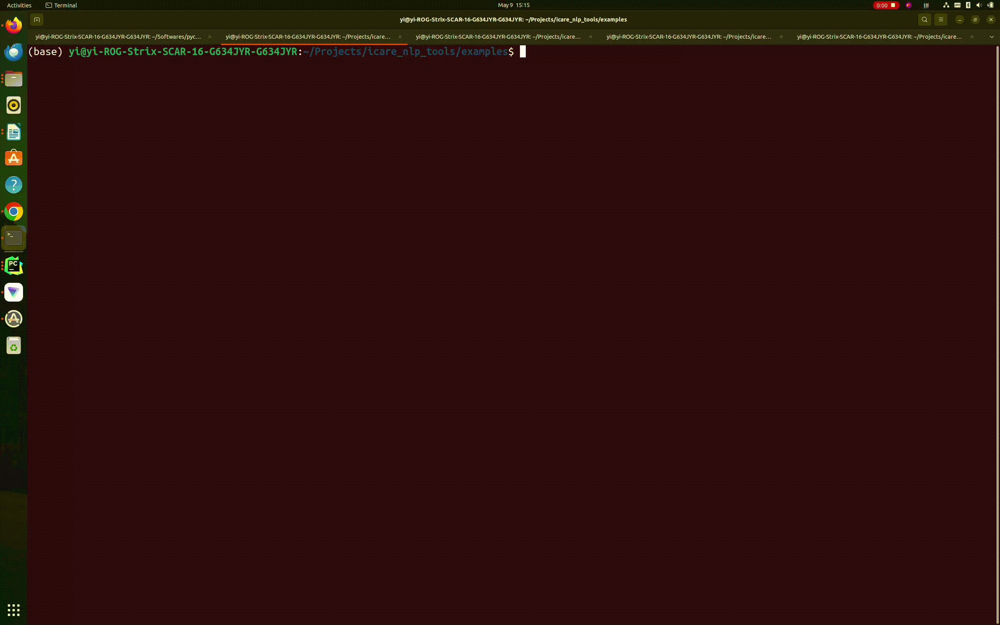

#### 1. 安装
##### (1). 方法1：使用pip安装
~~~
pip install icare-nlp
Pypi链接: https://pypi.org/project/icare-nlp/
~~~
##### (2). 方法2： 使用Source Codes安装
~~~
git clone https://github.com/YiyiyiZhao/icare_nlp_tools.git
cd icare_nlp_tools
pip install -e .
pip install -r rewuirements.txt
~~~

#### 2. 使用
##### 2.0 Task_Disp: 输入User query, 输出对应下列四种的Task类型
###### (1). Commands
~~~
from icare_nlp.task_disp import TaskDisp

task_disp=TaskDisp()
task_disp.disp_start()
~~~
###### (2). Demo
***Object Description and QA***

***Receipt Description and QA***

##### 2.1 Object_Desc: 输入object detection list, 输出场景播报
###### (1). Commands
~~~
import json
from icare_nlp.object_desc import ObjectDesc
obj_desc=ObjectDesc()

with open("./obj_detect_files/59.json", "r") as f:
    obj_detect=json.load(f)
print(obj_detect)
#[{'position': [1149, 580, 258, 270], 'text': 'chair'}, {'position': [958, 186, 235, 171], 'text': 'tv'}, {'position': [1130, 399, 211, 132], 'text': 'chair'}, {'position': [198, 388, 153, 52], 'text': 'chair'}, {'position': [664, 609, 259, 211], 'text': 'chair'}, {'position': [869, 384, 123, 164], 'text': 'chair'}, {'position': [162, 508, 94, 163], 'text': 'bottle'}, {'position': [785, 309, 56, 36], 'text': 'chair'}, {'position': [620, 341, 152, 177], 'text': 'suitcase'}, {'position': [577, 608, 436, 210], 'text': 'chair'}, {'position': [357, 336, 83, 72], 'text': 'chair'}, {'position': [417, 508, 830, 404], 'text': 'dining table'}, {'position': [862, 545, 121, 178], 'text': 'handbag'}, {'position': [862, 545, 122, 177], 'text': 'backpack'}, {'position': [791, 389, 91, 184], 'text': 'chair'}]

obj_desc_res=obj_desc.form_response(obj_detect)
print(obj_desc_res)

#而家眼前嘅景象有9把椅, 1台電視, 1瓶樽, 1個行李箱, 1張飯枱, 1個手袋, 1個書包.視線左上角嘅場景入面有1個行李箱.視線左上角嘅場景入面有1把椅.視線右上角嘅場景入面有1台電視.視線右上角嘅場景入面有1把椅.視線左下角嘅場景入面有2把椅.視線左下角嘅場景入面有1瓶樽.視線左下角嘅場景入面有1張飯枱.視線右下角嘅場景入面有5把椅.視線右下角嘅場景入面有1個手袋.視線右下角嘅場景入面有1個書包.
~~~
###### (2). Demo

##### 2.2 Object_QA: 输入object detection list 和 Question, 输出场景有关的Answer
###### (1). Commands
###### (2). Demo

##### 2.3 Receipt_Desc: 输入Receipt的OCR识别文本, 输出Receipt描述
###### (1). Commands
###### (2). Demo

##### 2.4 Receipt_QA: 输入Receipt的OCR识别文本, 输出票据总价
###### (1). Commands
###### (2). Demo

#### Run Example
~~~
from icare_nlp.object_qa import ObjectQA
#question
#obj_detect
ans=object_qa.form_response(question, obj_detect)
~~~
~~~
cd  examples
python object_qa.py > qa.out
可以查看qa.out文件查看输入object_detect 和 question下，输出的answer
~~~